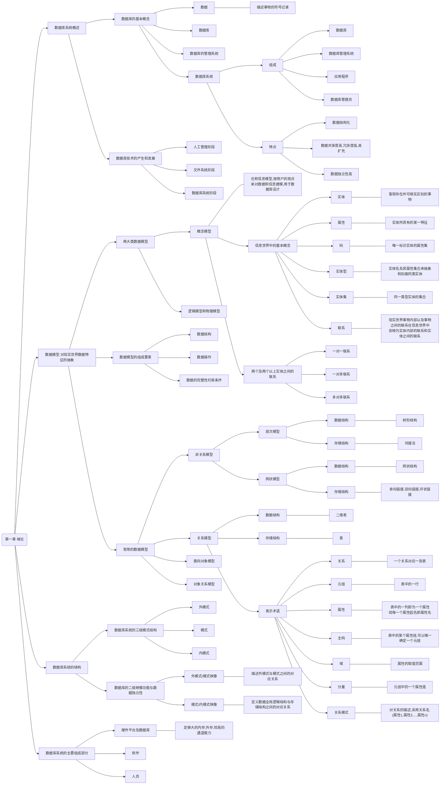
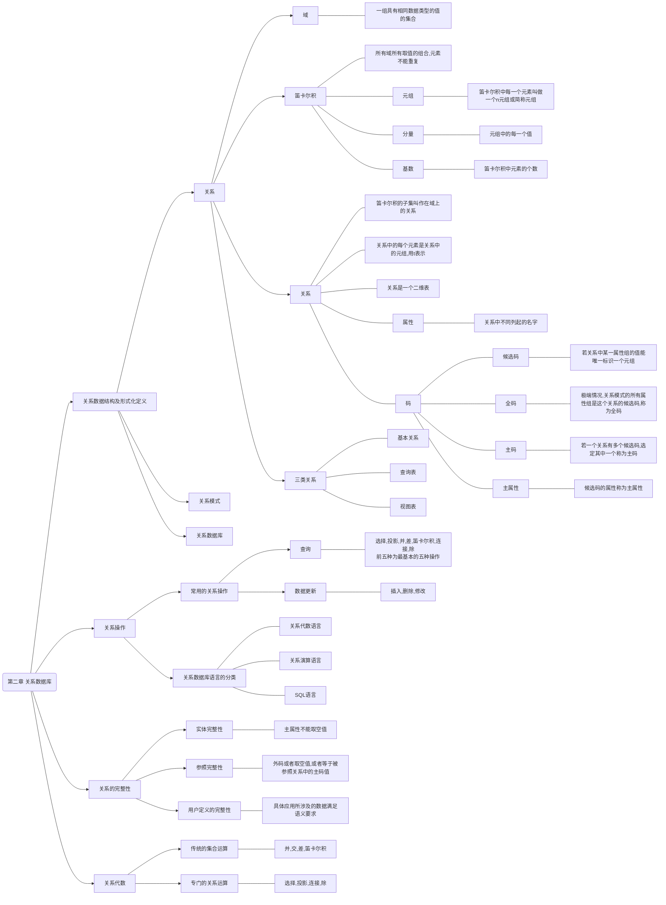
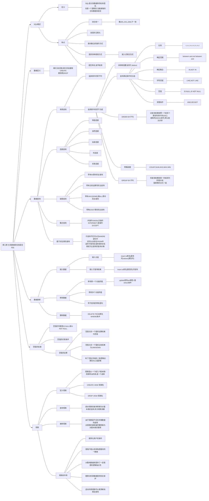
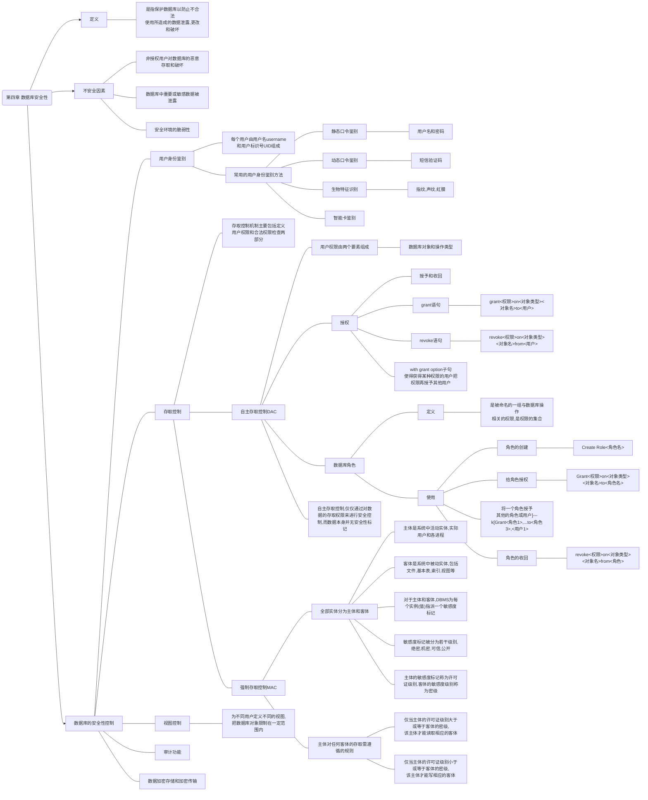
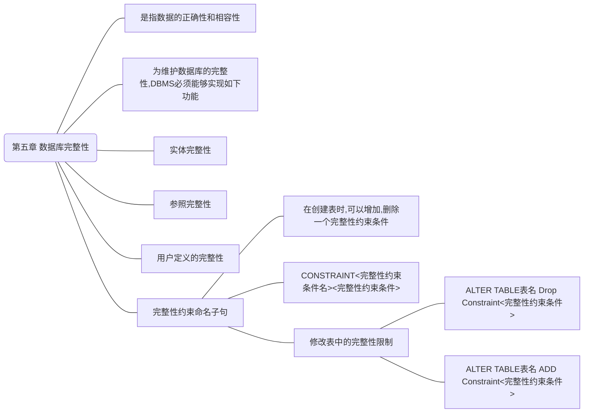
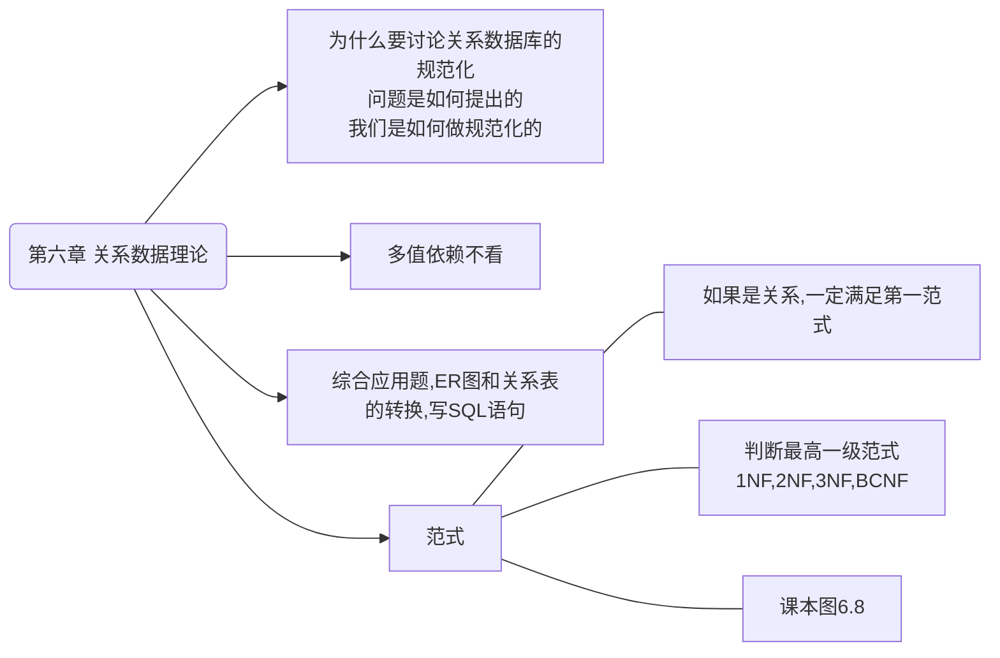

#### 题型：

单选：10 个 × 2 分

填空：10 个 × 1 分

综合应用题：3 个，每个 10-30 分（考察2-6章知识点，重点为关系代数和sql语句）













```mermaid

flowchart LR
a(第七章 数据库设计)-->课本图7.2,数据库设计步骤,了解设计的各个阶段
a-->课本图7.3
a-->课本图7.7-7.9的实例,图7.11 
a-->课后题7,8,10,11

```

